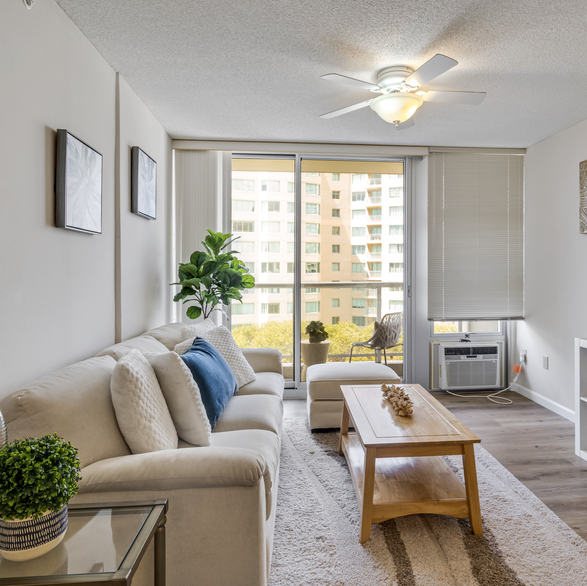

As a skilled real estate photographer, having advanced photography skills that include composition, lighting, angles, and equipment expertise is essential. My goal is to create images that evoke spaciousness, warmth, and luminosity. With the use of professional-grade tools such as high-resolution cameras, wide-angle lenses, and drones, I am adept at navigating camera settings to capture authentic interior and exterior shots that truly showcase the property. I also contribute to the arrangement and staging of spaces, making subtle decorative modifications and optimizing lighting for maximum visual appeal.

My job is to make sure that furniture is lined up perfectly, the space is clean and clutter-free, and everything looks visually appealing and accurate. Once the initial photos are taken, I also edit and enhance the images by adjusting colors, exposure, and removing any minor flaws. Communication with clients is key to understanding their preferences and meeting their expectations while providing professional advice. It's important to maintain a consistent visual style across different properties for the same client to maintain brand identity and increase marketing effectiveness.

 
[House Hike Drone Instagram](https://www.instagram.com/househike_realestatemedia_hi/).
[House Hike WEBSITE](https://househikerealestatemedia.com/). 
