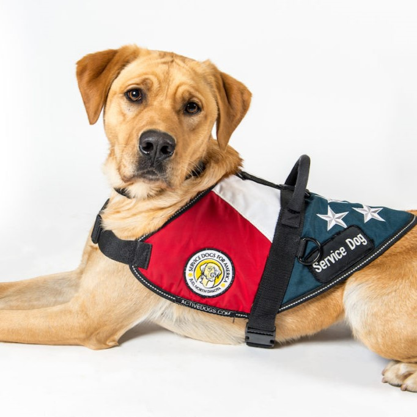

  
  
  

Seventy percent of the U.S. population owns pets, encompassing a variety of animals such as dogs, cats, birds, and horses, reflecting the psychological and physical benefits of human-animal interactions (American Veterinary Medical Association, 2022). This paper delves into three key factors shaping the landscape of service and emotional support animals in society. Firstly, it explores the legal framework surrounding these animals, highlighting existing loopholes. Secondly, the paper discusses the accessibility convenience factor for these animals in public spaces. Lastly, it examines the implications of online certification for service and emotional support animals. By addressing these aspects, the paper argues that service and emotional support animals offer more positive impacts on society's well-being compared to traditional service aids.

The U.S. Department of Services Animal website defines service animals as those that perform specific tasks for individuals with disabilities, aiding them in overcoming limitations caused by their condition (Batiste, Carter L & Fullmer C, 2011., p3). The Americans with Disabilities Act (ADA) outlines various tasks these animals undertake, such as aiding individuals with vision or hearing impairments, providing protection, assisting during seizures, and even offering support for psychiatric and neurological disabilities. Emotional support animals, distinct from ordinary pets, play a crucial role in spaces where domestic animals are typically restricted. Loopholes in the law exist, with Title III of the ADA defining service animals but creating ambiguity, especially concerning emotional support animals.

You can read this research at the [Service Animals and Emotional Support](https://docs.google.com/document/d/11vTA9OI36-52onotiW8nomZ_Q1rc3nBFG18Khuu8YLk/edit?usp=sharing).

